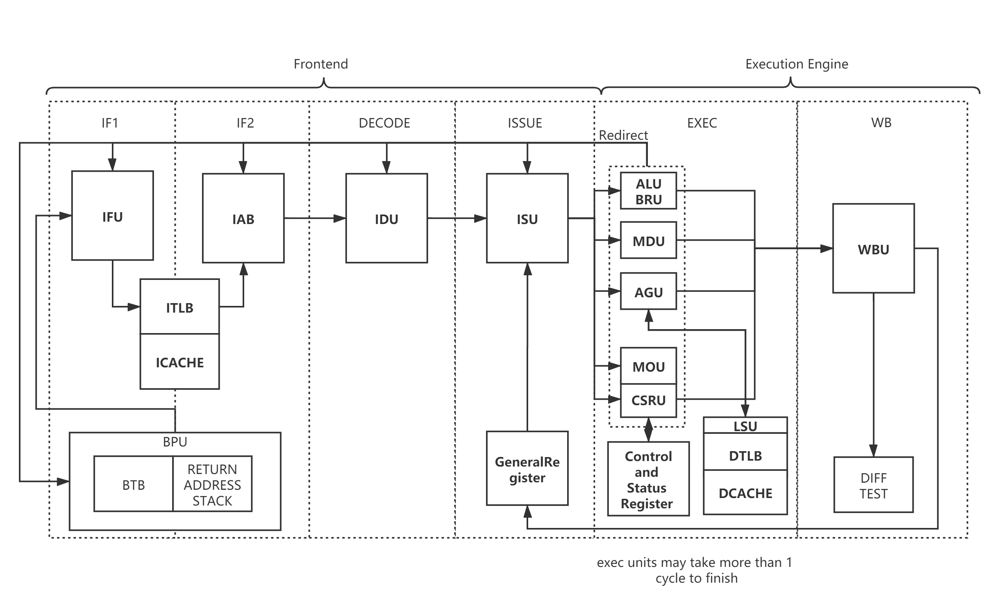

# NutShell 处理器介绍

NutShell 是使用 Chisel 语言模块化设计的, 基于 RISC-V RV64 开放指令集的顺序单发射处理器实现, 隶属于国科大与计算所“一生一芯”项目. 这款处理器的很多设计受到了 NOOP (南京大学教学用五级流水线处理器) 的影响. 

NutShell 基于 9 级流水线顺序设计. 存储系统方面, NutShell 包含一级指令缓存和数据缓存及可选的二级缓存. 处理器通过 AXI4 总线与外界相连. NutShell 支持 M、S、U 三个特权级, 支持 I、M、A、C、Zicsr 与 Zifencei 指令扩展, 支持虚实地址转换, 包含页表缓冲 (TLB) 以加速地址转换过程, 支持 Sv39 分页方案.

整体的微结构设计如下图所示：

NutShell 的设计由三部分组成: 负责分支预测和取指的前端 (Front-end), 负责执行指令的执行引擎 (Execution Engine, 也称后端 Back-end), 以及用于访存操作的访存单元 (LSU). 前端完成取指与译码操作后会将指令放置在译码缓冲区中. 后端从译码缓冲区中读出指令并顺序执行. 访存单元作为一个功能单元 (FU) 包含在后端流水线中. 控制逻辑分布在流水线的各个部分.