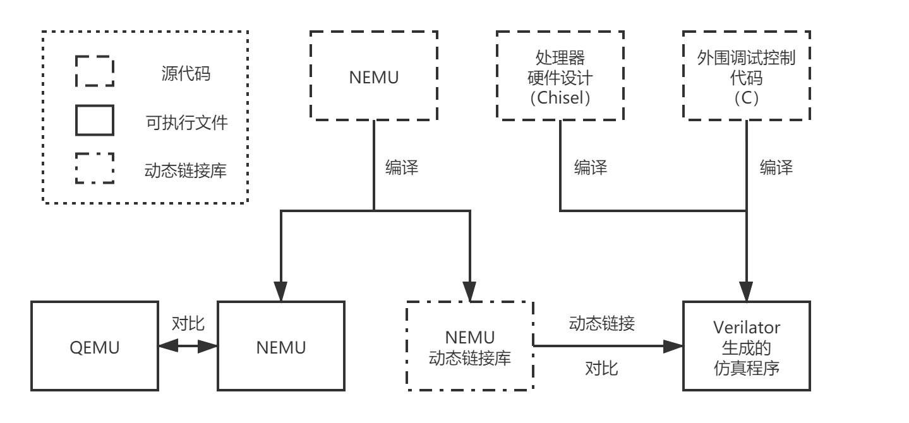

# 调试指南

依托 Chisel/Scala 的高级语言特性和 Verilator 模拟器的强大功能, NutShell 在调试方面十分方便, 基本可以摆脱传统 Verilog 开发中根据信号波形进行调试的方式. 下面将介绍一些我们在开发过程中的调试技巧.

## 差分测试框架

差分测试框架是 NutShell 开发的一大亮点, 也是我们实现敏捷开发的关键点之一. 使用该方法, 我们创造了 2 天修复 6 个启动 Debian 过程中复杂 Bug 的奇迹, 且均为一次定位, 无需通过波形回溯. 整个差分测试框架的结构图如下所示：



其中, NEMU (NJU Emulator) 是一个南京大学的教学模拟器, 它的正确性由 QEMU 作为保证. 我们通过对比每一条指令执行后处理器的状态与 NEMU 的执行状态, 来判断处理器是否正确地执行了当前指令. 具体的实现细节参考 `src/test/csrc/difftest.c` 和 `src/test/csrc/emu.h` 等文件. 当仿真时出现对比失败, 则会自动停止仿真, 同时打印出出错位置的寄存器值和最近执行的指令与 PC.

差分测试是默认开启的, 如果想要关闭, 可以手动设置 `src/main/scala/sim/DiffTest.scala` 里 `enable` 的初始值为 false.B, 或者在测试程序中加入对 `AXI4DiffTestCtrl` 这一外设的读写.


## 日志调试

在日常开发代码功能的过程中, 我们最常使用的是日志调试的方式. 在代码中调用 printf() 函数即可在仿真时打印出日志, 常见的使用方式有如下：

* C语言格式：printf("Log: %x, %d\n", signal1, signal2)
* Scala语言格式：printf(p"Log: \${signal1}, \${signal2}\n")

以上两种语句均会在每一拍输出一条对应的 Log, 我们也提供了一个 GTimer() 函数返回当前的运行周期数, 方便在调试的时候作为参考. 另外, 日志的输出可以放在 Chisel 的条件语句中, 当且仅当该周期的条件为真时才会打印出该条日志, 示例如下：

```
when (io.flush || io.dtlb.req.fire()) {
    printf(p"Time: ${GTimer()}, Fire: ${io.dtlb.req.fire()}\n")
}
```

### Debug 调试框架

我们在日志输出的基础readthedocs上建立了一个 Debug 框架, 实现参考 src/main/scala/utils/Debug.scala, 开发者只需要在代码的相应位置调用 Debug() 函数包络日志输出语句, 即可以将日志输出的控制权交由一个可配置的 ”EnableDebug“ 开关, 避免了在测试完成后需要手动删除所有的日志输出语句. 示例如下：

```
Debug(){
    printf("xxxxxx")    // 无条件输出
    when(xxx){          // 条件输出
      printf("xxxxxx")
    }
}
```


## 波形调试

在一些必要的情况下, 可能开发者还是需要使用波形来进行调试, 我们在设计中也保留了这一功能.  在 `Makefile` 中 `VERILATOR_FLAGS` 的赋值里添加额外添加两个参数 `--debug --trace` 即可在仿真时生成 VCD 波形文件.