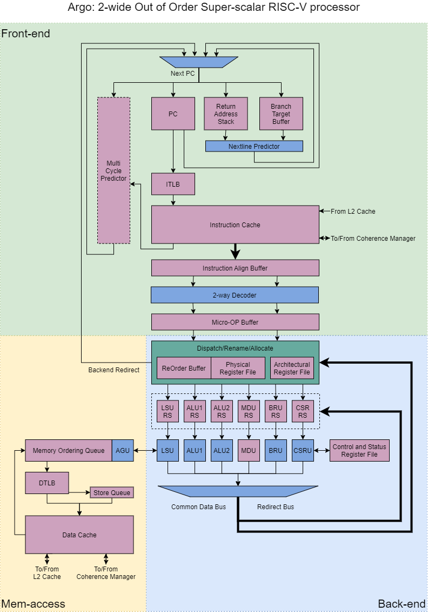

Argo Processor Technical Reference Manual
=====================

* Copyright (c) 2019-2020 Huaqiang Wang. All rights reserved.
* wanghuaqiang16@mails.ucas.ac.cn

NOTE: 这里面的内容纯属画饼, 如果实现, 纯属巧合. 

在没有特殊说明的情况下, 每个部分中列出的列出的技术要点按从上至下的路线实现.

---

# 1. 文档历史

Date|Change
-|-
2019.12.23|确定技术路线
2020.3.3|超标量微架构框架
2020.4.5|前后端基本说明
2020.4.14|完善跳转取消部分的说明
2020.4.22|完善访存子系统说明
2020.7.12|将原始的文档迁移到NutShell文档中

---

# 2. 目录

[TOC]

---

# 3. 总述

Argo是使用Chisel语言设计的, 基于 RISC-V RV64IMAC 开放指令集的乱序多发射处理器实现. Argo采用基于隐式重命名(Rename-In-ROB)的乱序设计, 采用分布式保留站, 分派时读取寄存器的设计模式. 存储系统方面, Argo包含一级指令缓存和数据缓存及可选的二级缓存. 处理器通过AXI4总线与外界相连. Argo支持M, S两个特权级, 支持Zicsr与Zifence指令集扩展. 支持虚实地址转换, 包含页表缓冲(TLB)以加速地址转换过程.

<!-- TODO: 前后端分离 -->

Argo的开发受到了`BOOM`的很大影响. Argo包括前端取指部分, 后端执行部分和访存处理部分这三大主要部分.



`Argo`的技术路线是, 先实现长流水的前端与简单顺序后端以进行功能验证. 在此过程中完善测试框架并验证其可靠性. 实现RISC-V指令集上的各个指令并验证实现的正确性, 以确保能正确理解RISC-V指令集. 这一版本被称为顺序单发射版本. 在顺序单发射版本上尝试启动Linux等复杂操作系统, 验证特权指令与虚拟存储相关机制的实现. 在验证通过后尝试流片. 此后进行顺序双发射版本的开发. 在顺序单发射版本的基础上扩展前端的宽度, 同时在后端添加简单的顺序双发射逻辑. 通过这一版本验证超标量前端逻辑的正确性, 并设计超标量处理器核的正确性比对逻辑. 在最终阶段, 重构后端实现为乱序实现, 在这一基础上针对之前版本中简化的逻辑进行扩展, 以尽可能地提高乱序核的性能表现. 可见, 乱序处理器的模块是在这三个阶段中逐步完成的. 通过逐步迭代设计可以避免同时引入大量新模块, 导致错误难以定位的问题. 事实证明, 逐步迭代设计是正确的开发思路. 下面将简要介绍前两个版本的设计.

处理器版本|前端实现|后端实现|访存实现
-|-|-|-
顺序单发射 NOOP-RV64|标量取指单元|标量执行单元|多周期访存单元
顺序双发射 NOOP-RV64D|Jason超标量取指单元|超标量执行单元(主副流水线)|多周期访存单元
乱序双发射 Argo|Jason超标量取指单元|Hercules乱序执行单元|Achilles流水化访存单元(支持乱序)

表: 不同版本的处理器实现所采用的的模块

## 3.1. 顺序单发射

TODO: PIC

图1: 顺序单发射处理器的流水线结构.

图1展示了顺序单发射处理器的流水线结构. 除去取指部分包括多个流水级外大体上可以看成取指/译码/执行/写回四级流水. 顺序单发射处理器设计中简化的部分包括:

1) 访存单元采用多周期的设计, 同一时刻只能有一条访存指令由状态机控制执行.
2) 执行级只有一级, 且同时只能容纳一条指令.

由于访存单元的多周期设计, 一条访存指令至少需要三个周期才能完成执行. 这是此顺序单发射实现的最大瓶颈.

## 3.2. 顺序双发射

TODO: PIC
图2: 顺序双发射处理器的流水线结构

图2展示了顺序双发射处理器的流水线结构. 顺序双发射处理器可以看作是对上面顺序单发射处理器的简单扩展. 由于顺序双发射处理器并非最终的设计目标, 因此在设计的过程中同样进行了一定程度上的简化. 简化的部分包括:

* LSU采用多周期的设计, 同一时刻只能有一条访存指令由状态机控制执行.
* 执行级只有一级, 且同时只能容纳一条指令.
* 主副流水线设计, 只有ALU指令可以经由副流水线执行.

除取指部份外顺序双发射核心也可以看成是取指/译码/执行/写回四级流水. 主副流水线的设计使得设计和硬件复杂度得以简化, 但是放弃了很多挖掘指令并行性的机会. 执行流水线也没有进行深入的优化, 多周期访存仍然是其最大的瓶颈.

## 3.3. 乱序双发射

乱序双发射是主要的设计目标. 顺序处理器中简化的设计在乱序设计中不再简化. 访存单元被流水化, 不同的功能单元组成了非对称长度的执行流水线. 微架构细节将在下文详述.

---

# 4. 微架构说明

## 4.1. 乱序超标量架构整体设计: Argo


Argo的设计由三部分组成, 负责分支预测和取指的前端(Frontend), 负责执行指令的后端(Backend), 以及用于访存操作的访存单元(LS). 前端完成取指与译码操作后会将指令放置在译码缓冲区中. 后端从译码缓冲区中读出指令并乱序执行. 访存单元作为一个功能单元(FU)包含在后端流水线中. 

一条指令在Argo中执行的流程如下. 单周期分支预测器(NLP)预测出下一周期要发给ICache的取指地址. ICache一次返回64bit的结果, 将结果保存到指令对齐缓冲(IAB)中. 指令对齐缓冲判断指令的长度并将不同的指令分离. 如果有指令横跨两次ICache结果, 指令对齐缓冲会负责将其拼接成一条指令. IAB每周期将至多两条拼接好的指令交给指令译码单元(IDU)进行译码. 指令译码单元每周期至多翻译两条指令, 并将结果写入到译码缓冲区中, 此时指令在前端的处理宣告结束. 后端顺序读取译码缓冲区中的指令. 当发现后端目前所持有的空闲资源(空重排序缓冲项, 空保留站项等)足以满足指令的要求, 且没有其他特殊原因(如特权指令的串行化限制)阻止指令执行时, 将指令分派到后端对应的部件中. 指令会被分配一个保留站项, 并根据其类型分配到对应的保留站中. 在分派阶段, 指令读寄存器获取所需的源操作数并将其写入到保留站中. 指令在保留站监听未就绪的源操作数, 等待到所有源操作数就绪, 且功能单元(FU)允许指令进入后将指令发射到功能单元. 功能单元在完成指令指示的操作后将结果写回到公共数据总线(CDB)上. 公共数据总线上的结果会被广播到各保留站及重排序缓冲(ROB). 此后, 指令在ROB中等待前导指令全部提交完毕后进入提交流程. 提交操作使这条指令根据其结果对处理器状态产生不可逆的影响. 提交操作后, 流水线不再跟踪这条指令, 指令的执行彻底结束.

## 4.2. 前端: Jason

### 4.2.1. 整体设计

`Argo`所采用的前端`Jason`默认宽度为2, 包含一个单周期分支预测器及可选的多周期分支预测器. 单周期预测器结构简单, 负责给出下一周期指令缓存(ICache)请求的地址. 多周期分支预测器结构复杂, 负责给出精确的跳转预测. 前端每周期可以从ICache中取得最多64bit的指令. 我们称ICache每次返回的64bit结果为一个指令行(Instruction Line). ICache返回的结果会进入指令对齐缓冲, 由指令对齐缓冲来处理非对齐及非定长指令. 指令对齐缓冲最多可以同时装载4条指令, 输出2条指令. 指令对齐缓冲将输出结果提供到宽度为2的译码单元进行译码. 前端尾部设置了译码结果缓冲区. 译码结果会被暂存到译码结果缓冲区中, 以实现尽可能解耦前端与后端的目的. 

### 4.2.2. 单周期分支预测器 NLP

单周期分支预测器负责给出下一周期前端指令缓存请求的地址. 在单周期分支预测器预测跳转不会发生的情况下, 前端会发出当前程序计数器(PC)+8的取指请求. 默认的前端分支预测器使用两位饱和计数进行预测, 提供512项的跳转目标缓存(BTB)和16项的返回地址栈(RAS).

针对64bit的取指宽度, NLP会返回4bit的跳转预测向量. 跳转预测向量标识在哪条指令处可能发生跳转. 在一个指令行中存在多个潜在的跳转时, NLP只预测最早的一条分支的结果.

#### 4.2.2.1. 非对齐指令跳转预测

RISC-V的压缩指令会将32位的指令压缩为16位的指令. 只有部分常用的指令能够进行压缩, 压缩后的指令可以在译码阶段之前展开为32位的正常指令. RISC-V默认的指令长度为32位, 默认指令对齐也是32位. 在取值地址不对齐时会产生取指地址对齐异常. 在启用压缩指令的情况下, 指令对齐变成16位. 无论是32位长的指令或是16位长的指令均可以按16位对齐, 此时取值地址对齐异常不会产生. 这样的设计是基于RISC-V"不对特定微体系结构做优化"的原则, 但是这样的对齐方式却为取指带来了困扰.

在启用压缩指令集的情况下, RISC-V指令可以是2字节对齐的. 如下图所示. 

```
// 非对齐跳转指令横跨两个指令行(两次Cache访问)的情况
0: ADD(Compressed) a0, a0, a1
2: MUL a2, a2, a3
6: BNE a1, a2, 24
10: MUL a2, a2, a3
12: ...
```

第一次ICache请求返回的结果
ADD1|MUL1|MUL1|BNE1
-|-|-|-
0|2|4|6

第二次ICache请求返回的结果
BNE1|MUL2|MUL2|...
-|-|-|-
8|10|12|14

图: 非对齐跳转指令横跨两次Cache访问的指令示例

当一条32位的跳转指令横跨两次取指时, 如果在第一次取指时就预测其跳转, 会导致指令的下半部分没有办法取得. 这种错误可以在取得指令之后通过检查发现. 但是这样会导致从发射预测的跳转结果到重新发送指令后半段的取指请求期间的取指结果全部撤销. 由此产生前端空泡, 影响前端取指部分性能. 为此, `Argo`还提供了非对齐指令跳转预测的额外功能. `Argo`采用的策略是在单周期分支预测器NLP中预测这种情况的出现, 在这种情况出现时将下一周期的Cache请求的地址设置为顺序地址. 取出指令的后半部分的ICache请求发出之后, 再根据跳转预测的结果发送Cache请求.

```
0
24  //跳转目标地址
28
...
8   //发现跳转指令的后半部分没有取得, 发出跳转指令的后半部分的取指请求
24  //跳转目标地址
```
图: 不使用非对齐指令跳转预测时ICache收到的取指请求

```
0
8  //预测到跳转指令需要两次Cache访问, 发出跳转指令的后半部分的取指请求
24 //跳转目标地址
```
图: 使用非对齐指令跳转预测时ICache收到的取指请求

### 4.2.3. 多周期分支预测器 MCP

出于时序考虑, 一些复杂的分支预测器需要多个多个周期来完成分支预测. 除此之外, 我们还可以根据预译码的结果来对分支跳转进行修正. 多周期分支预测器(MCP)与单周期分支预测器(NLP)同时开始预测, 但是会在预测结束后将预测结果添加到分支预测队列中. 在取得跳转译码结果后, 前端从队列中取出多周期分支预测的结果. 根据预译码的结果进行修正后, 若多周期分支预测的结果与之前的预测不同, 则发出前端重定向请求. 在不影响后端执行的前提下加载来自预测结果分支的指令.

### 4.2.4. 指令页表缓冲

`Argo`包含一个4项的小型指令页表缓冲. RISC-V的TLB重填是由硬件负责的. 在页表缓冲没有命中时, 指令页表缓冲(ITLB)会向数据缓存(DCache)发出请求, 根据`satp`CSR寄存器的值来读取对应的页表.

### 4.2.5. 指令缓存

`Argo`使用三级流水的缓存作为一级缓存. 默认配置下以及缓存是四路组相联的. 数据缓存与指令缓存的结构相似. 在第一个流水级传入地址, 第二个流水级进行tag的比对, 第三个流水级返回结果或向外发出访存请求. 由于时间的限制, `Argo`使用的缓存使用实地址进行索引, 在开始Cache访问前必须先取得TLB查询的结果.

### 4.2.6. 指令对齐缓冲 IAB (IBF)

为了处理引入RISC-V压缩指令RVC后的指令对齐问题, 前端设置了单独的指令对齐缓冲(IAB). 

由于启用压缩指令的情况下指令可以是2字节对齐的, 因此一些指令会横跨两次ICache结果. 指令对齐缓冲根据指令地位的指令长度标识, 将ICache返回的结果组装成独立的指令. 在这一阶段, 也会使用标准的压缩指令(TODO: REF)展开逻辑来展开压缩指令为普通的指令, 从而降低译码(Decode)级的压力. 指令对齐缓冲每周期最多接受64bit的有效输入, 最多输出2条完成对齐的有效指令.

<!-- TODO: IBUF最多同时装载4条指令, 输出2条指令 -->

### 4.2.7. 跳转指令预译码

<!-- TODO: -->

Argo可以在ICache读取指令/返回结果时进行指令的部分译码, 判断其是否为跳转指令. 这样在ICache返回结果时就可以使用部分译码结果与多周期分支预测器的结果来一同更正指令流流向. 如果一条非跳转指令被预测为跳转, 则刷新IFU并从这条指令的顺序后续指令开始取指.

对于需要两次取指才能取回的指令, 即一条32位的指令分布在两次Cache请求结果的末尾和开头的情况, 预译码仍能正确判断其是否为跳转指令. 这得益于RISC-V指令集的编码设计. 如果一条指令是16位的压缩指令, 那一定可以根据指令前16位的内容判断其是否为跳转指令. 而如果一条指令是32位的常规指令, 标志着其为跳转指令的信息也能在低16位指令中取得. 因此, 对于需要两次取指才能取回的指令也可以在其前半部分返回时判断出其是否为跳转指令.

## 4.3. 后端: Hercules

### 4.3.1. 整体设计

`Argo`所采用的乱序后端`Hercules`是基于隐式寄存器重命名(Rename-in-ROB)的乱序设计. 在一条指令的结果被确认有效前, 其将被暂存在ROB中对应的结果域内. 直到一条指令被确认有效之后, ROB中的结果才会写回到物理寄存器堆中. 乱序后端采用分布式保留站, 支持精确例外回溯. 乱序后端最多同时发射两条指令, 提交两条指令. 特权指令, 例外与中断会导致后端退化成顺序单发射. 访存单元连接 PIPT Cache.

指令在乱序后端中执行时的关键动作如下:

分派(Dispatch)指检查待发射指令的相关性, 将指令从后端指令输入端口被分别发送到不同保留站并在ROB中分配对应项的过程. 指令的分派是一个顺序的过程, 在前面的指令没有完成分派的情况下, 后面的指令不能越过前面的指令被分派. 由于所有的保留站均只有一个输入端口, 因此同时分派的指令的数目也受到保留站数目的限制. 在此阶段中, 正在被分派到保留站中的指令也会尝试获取所需源操作数的值, 根据寄存器映射表的信息从ROB的结果项或体系结构寄存器中读出所需的值. 如果所需的源操作数未就绪, 则在写入保留站的过程中将此数据项标识为未就绪, 由保留站在数据就绪时获取数据.

发射(Issue)指在保留站中的指令在其所有源操作数就绪, 且目标功能器件就绪的情况下, 被发送到功能器件开始执行的过程. 源操作数未就绪的指令会保留在保留站中, 等待所需的源操作数.

写回(Writeback)指功能部件完成其操作后, 将指令的结果广播到公共数据总线上的过程. 在这一过程中, 同时请求公共数据总线的功能部件可能要高于公共数据总线的最大宽度. 为此有两种可能的解决方案. 一是直接争用, 各个功能器件按照优先级争夺公共数据总线的使用权, 没有获得使用权的指令不能离开功能器件. 二是添加公共数据总线广播队列, 将没有取得公共数据总线使用权的指令及其结果添加到一个队列中, 待公共数据总线空闲之后再行提交. 各保留站会监听公共数据总线上广播的结果, 提取保留站内源操作数未就绪指令所需的源操作数. 同时, ROB也会监听公共数据总线上的结果, 将结果写回ROB内对应的位置上, 并标识该指令为"已写回"的状态.

提交(Commit)指确认一组指令(取决于ROB宽度)确定会执行, 使得这条指令的各种效应生效的过程. 能够合法提交的指令之前的所有指令都已经被确定会执行(提交), 且之前没有重定向操作阻止这条指令被执行. 在这种情况下, ROB会分析同时提交的指令之间的相关关系, 选取有效的指令并完成相应的提交操作. 提交操作包括写回指令的结果到体系结构寄存器堆中, 使其对应的重定向请求生效, 使`store`指令对应的访存操作开始执行. 提交成功代表着这条指令不会被撤销, 此后重定向缓冲(ROB)不再需要追踪这条指令.

特殊地, 对于某些特权指令, 其效应生效的过程要早于提交的时刻. 比如缓存一致性指令, CSR寄存器操作等. 由于这些指令出现的次数要远少于正常指令, 这些指令并不支持乱序执行. 后端在检测到这些指令时会阻塞流水线, 直到这些指令之前的所有指令均已提交才会允许这些指令开始执行. 即, 这些指令并不会被推测执行, 因此其效应在提交前生效不会产生影响.

进入后端执行的指令, 按照其在流水线中的位置, 可以分为以下几个状态:

1. 译码(Decode)完成, 等待分派(Dispatch)
1. 分派(Dispatch)完成, 等待发射(Issue)
1. 指令发射(Issue)进入功能部件, 等待执行完成后写回(Writeback)到公共数据总线
1. 指令结果已由公共数据总线写回ROB, 正在等待这条指令之前的指令按序提交(Commit)
1. 之前指令的结果已全部提交, 这条指令正在提交(Commit)

访存类指令根据其执行的不同阶段, 相比其他指令有更多的状态. 访存指令的额外状态将在访存系统部分详细介绍. 

### 4.3.2. 分派总线

指令进入到后端后通过分派总线分派到保留站和重排序缓冲. 在指令分派时会检查指令间的相关情况并设置相应标识位, 检查是否有阻塞流水线的指令并采取相应行动.

### 4.3.3. 重排序缓冲

重排序缓冲是乱序执行的核心器件之一. 为了实现精确例外, 指令必须顺序结束以保证引发例外指令之后的指令不会对处理器的状态产生不可逆的影响. 指令在开始乱序执行时依照顺序进入到重排序缓冲中. 当重排序缓冲头部的指令全部写回结果之后, 重排序缓冲启动退出机制(提交), 允许提交的指令对处理器的状态产生不可逆的影响.

`Argo`的重排序缓冲采用两路组相连的形式(路数可以根据发生宽度变化). 每次指令成功分派时推进重排序缓冲头部指针, 
TODO

`Argo`中的重排序缓冲在指令提交时所触发的不可逆操作包括: 写回指令的结果到物理寄存器, 为错误的分支预测跳转和例外处理启动PC重定向机制, 通知LSU`store`操作可以开始执行, 检测后端执行过程中触发的例外并通知CSR.

### 4.3.4. 保留站

指令在进入后端后会被分派到各个保留站, 等待自身所需的源操作数以及功能器件就绪之后再被执行. `Argo`采用了分布式保留站的设计. 在默认情况下各个保留站根据入站的先后顺序设置优先级掩码, 跟据优先级掩码来决定指令出站的优先级. LSU对应的保留站属于例外情况, 指令的出站受到访存指令的顺序限制. 由于LSU将顺序执行访存单元保留站发出的指令, store指令在出站时必须保持与其他store指令的顺序关系. 否则, 最终写入DCache的数据将出现问题. 出于简化设计考虑, LSU的保留站和访存单元中的访存重定序队列彼此分离. 只有在LSU保留站中准备好操作数, 计算出访存目标虚拟地址的指令才可以进入到访存重定序队列中. 所有的保留站均会监听公共数据总线, 在公共数据总线上出现保留站所需的数据时更新保留站中指令的源操作数及状态. 在允许跳转指令提前取消的情况下, 重定向总线也会提供相应的跳转ID, 使得保留站可以根据跳转ID取消不应被执行的指令.

### 4.3.5. 公共数据总线

公共数据总线接受功能部件的结果, 将其提交到重排序缓冲并广播给各个保留站. `Argo`当前的公共数据总线宽度为2. 完成执行的指令在提交到公共数据总线的过程中需要经过仲裁. 在多条指令同时提交的情况下, `Argo`有两种可选的方式来选择能够广播到公共数据总线上的指令.

1) 功能部件分为两组: 第一组包括ALU/BRU, MDU, CSR, MOU, 第二组包括ALU, LSU. 两组功能部件各对应一个提交端口. 提交时, CSR, MOU等特殊指令在执行前会等待流水线清空, 不会出现争用. MDU, LSU在可以写回时立即写回, ALU/BRU在出现争用时进行退避, 暂缓写回.

2) 功能部件不分组, 各功能部件同时争夺写回端口的使用权. LSU, MDU等需要较长时间完成的功能器件拥有较高的优先级, 以保证依赖这些指令结果的指令能尽早开始执行. 没有获得提交端口使用权的指令暂缓写回.

<!-- 写回队列: 效果不明显 -->

### 4.3.6. 物理寄存器堆

`Argo`采用隐式寄存器重命名的设计, 会在指令分派`dispatch`时读取重命名寄存器和物理寄存器, 在指令写回`writeback`阶段写入重命名寄存器, 在提交`commit`阶段读取重命名寄存器并写入物理寄存器. 目前重命名寄存器堆默认为为6读2写, 体系结构寄存器堆为4读2写. 在时序允许的情况下, 将公共数据总线宽度提高到3, 重命名寄存器堆扩展到6读3写可以更好地减轻写回端口争用对性能的影响.

### 4.3.7. 功能单元

`Argo`的功能单元从保留站获取源操作数和译码信息进行计算, 计算完成后将结果提交到公共数据总线上. `Argo`包含以下标准功能单元:

#### 4.3.7.1. ALU/BRU

算数逻辑单元`ALU`负责处理整数运算指令. 其加法器同时也可以被用来计算跳转指令所需的地址.

#### 4.3.7.2. MDU

乘除法单元`MDU`负责处理所有的乘法与除法指令. 目前的乘除法单元尚未流水化, 只支持一条指令在其中执行.

#### 4.3.7.3. CSR/MOU

控制与状态寄存器单元`CSR`与访存定序指令单元`MOU`用于处理各种特权指令. 与常规功能单元的区别为进入这两个功能单元的指令会阻塞流水线. 从ROB到CSR有一条额外的数据通路以处理处理器后端触发的例外.

#### 4.3.7.4. LSU

访存单元`LSU`负责处理所有的访存指令. 详见访存系统部分.

#### 4.3.7.5. 功能单元接口

`Argo`支持额外添加功能单元以支持自定义指令. 自定义的功能单元接口与算数逻辑单元的接口基本相同. 下以添加额外的算数逻辑单元为例, 说明自定义功能单元的添加方式:

```scala
  val aluExtra = Module(new ALU(hasBru = true))
  val alueOut = aluExtra.access(
    valid = aluers.io.out.valid, 
    src1 = aluers.io.out.bits.decode.data.src1, 
    src2 = aluers.io.out.bits.decode.data.src2, 
    func = aluers.io.out.bits.decode.ctrl.fuOpType
  )
  alu1rs.io.out.ready := aluExtra.io.in.ready
```

功能单元可以接受来自保留站的源操作数及指令字段. 保留站与功能单元之间使用`DecoupledIO`相连.

```scala
  val aluecommit = Wire(new OOCommitIO)                       // 声明乱序写回总线
  alue.io.out.ready := alu1CDBready                           // 根据公共数据总线的仲裁结果, 判断是否可以进行写回
  aluecommit.decode := alu1rs.io.out.bits.decode              // 指令译码结果, 用于调试
  aluecommit.commits := aluOut                                // 功能单元运算结果
  aluecommit.isMMIO := false.B                                // Trace比对时是否需要跳过此指令结果, 用于调试
  aluecommit.prfidx := alu1rs.io.out.bits.prfDest             // 指令在ROB中的位置(指令占用的重命名寄存器)
  aluecommit.decode.cf.redirect := alu1.io.redirect           // 指令的重定向请求
  aluecommit.exception := false.B                             // 指令是否触发后端例外
  aluecommit.intrNO := 0.U                                    // 后端例外向量
```

提交时, 至少需要向公共数据总线提交以上的数据. 这些连线并不都会被综合为真实的电路实现, 用于调试的连线将在综合过程中自动被优化.

自定义的需要多周期完成的功能单元(流水化的或非流水化的)需要时刻监听公共数据总线上的跳转信息部分. 在监听到BRU发出的跳转取消请求时根据内部指令的跳转掩码取消在错误跳转分支上的指令. 当前正准备写回的指令不受跳转取消请求影响.

### 4.3.8. 例外处理

目前, 此乱序核心可以处理的例外可以按来源分为两类: 一般例外和后端例外.

在此实现中, 例外处理单元作为一个功能部件(FU)被接入到流水线中. 采用这一设计可以使特权指令复用常规指令的数据通路, 从而降低设计复杂度. 同时, 在写回阶段之前使得特权操作对CSR寄存器产生影响也可以使得CSR的差分测试成为可能. 得益于RISC-V指令集的后发优势, RISC-V的中断及异常机制较为工整. 除访存相关的异常之外, 其余异常以及中断均可以在译码级被检测出并直接发送到访存单元执行. 部分访存相关的异常需要到访存单元才能被检测出. 为了处理这样的异常, 重定向缓冲中设置了`intrNO`域和`exception`状态位来追踪后端访存处理单元(LSU)产生的异常. (除此之外, `intrNO`域的作用还包括在仿真时保存例外的相关信息, 以便于使用差分测试进行验证) 当一条指令准备提交时, 如果其在重排序缓冲(ROB)中的`exception`状态位被置高, 例外处理单元将会接收到此指令并进行处理, 并在产生结果之后重新写回到公共结果总线(CDB).

在访存操作中, 访存相关的后端例外会在地址生成之后(地址对齐异常)和TLB操作结束之后(缺页异常)产生. 这些例外在产生之后仅会设置标志位, 不会影响访存流程的正常执行. 这些标志位会在对应指令写回到公共数据总线时被读取并提交例外到公共数据总线上. 由于提交了例外, 涉及到`store`的操作会在提交前被取消, 不会触发内存写入操作.

TODO: 图

部分特权指令会导致流水线的强制刷新, 比如对`satp`寄存器的写入意味着虚拟存储相关的配置发生了变化, 需要强制刷新流水线来确保后续执行的指令使用的是新的配置.

### 4.3.9. 推测执行与跳转取消

在使用集中阻塞式访存系统的前提下, 推测执行部件的功能如下:

`CSR`与`FENCEI`指令在译码阶段被标记成不可推测执行的指令. (TODO: 指令介绍) 对于标记为不可推测执行的指令, 乱序发射部件会将其阻塞, 直至ROB队列完全清空. 在此情况下, 此指令可以被确定一定会被成功执行或被后端异常中断.

<!-- 如果跳转指令的取消与例外取消同时发生, 则 -->

通过提前取消跳转指令, 新的PC可以在跳转错误被发现之后立即提交到前端, 而不需等待这条指令之前的指令全部完成. 在分支预测错误的情况下可以有效减少因重定向导致的性能损失.

针对提前取消有多种实现方式, 主要的区别在于跳转现场的恢复方式. 一种做法保存跳转现场, 在发现分支错误时直接恢复. 其优点在于现场恢复的速度快, 只需要一个周期. 缺点是每条跳转指令需要保存完整的跳转现场, 显著增大了硬件复杂度. 大量现代处理器使用了这种设计(TODO). 另一种做法在发现跳转错误后逐步恢复跳转现场, 优势是不需消耗大量硬件资源保留现场, 劣势是逐拍恢复需要额外的周期.

`Argo`提供了"不进行提前取消", "提前取消, 等待跳转指令前的指令全部完成后再分派新的指令", "提前取消并通过检查点立即恢复处理器状态"三种实现. 后两种实现都需要为处于乱序执行状态的所有指令添加分支标识向量. 分支标识向量指示对应的指令受到那些分支指令的影响. 当分支指令进入后端开始执行后会获得一个分支编号. 此后所有指令分支标志向量上的这个位置均被置高, 代表指令受到分支的影响. 在分支指令预测正确正常结束之后, 回收分支编号并更新所有分支标识向量(将分支标志向量的对应位置置为低). 如果分支预测错误, 跳转处理单元会发出重定向请求, 并将这条跳转指令的分支编号进行广播. 保留站与重排序缓冲接收到广播的分支编号, 根据分支编号与分支标识向量比对的结果选取取消的指令.

<!-- 在发现跳转错误, ROB中此跳转分支后的指令被标识为无效状态后, ROB将会逐项释放这些指令所占用的资源. 这时重定向请求也会被发送到前端, 在后端回收资源的同时前端也开始根据新的PC取指. 由于新PC对应的指令到达后端也需要时间, 所以后端回收资源的影响一定程度上会被缓和. -->

## 4.4. 访存系统

<!-- 针对 PIPT Cache 的访存系统设计 -->

目前, Argo的Cache采用PIPT的索引模式. 因此在虚拟内存(Virtual Memory)开启的情况下, 在进行Cache访问之前需要进行TLB访问来将虚拟地址转化为物理地址. LSU会在`load`指令向DCache发出请求的同时的时候进行store queue写入和数据前递, 前递的内容为数据和位掩码. 在DCache返回结果时, LSU会根据根据位掩码将前递的数据与从Cache取回的数据拼接成新的结果.

在这一实现中, 访存指令在进入到访存处理单元LSU之后可以处于以下几种状态:

`load`指令

1. 等待请求DTLB
1. 等待DTLB结果
1. 等待请求DCache
1. 等待DCache结果
1. 等待写回到结果总线

`store`指令

1. 等待请求DTLB
1. 等待DTLB结果
1. 等待写入store queue
1. 等待写回到结果总线

对于`store`指令, 写回到结果总线并非指令的结束, 一条`store`指令在取得其物理地址之后会被加入到store queue中, 在这条指令确定被提交之后才会执行实际的访存操作. store queue中的指令可以分为两种状态:

1. 已取得物理地址, 等待指令提交
1. 指令已经提交, 等待请求DCache

LSU可以被划分成4个流水级: 地址生成与TLB请求(ADDR/TLB), DCache请求(Cache1), 等待DCache结果(Cache2), 获取DCache结果并写回(Cache3). 值得注意的是, 在刷新流水线时, 某些访存指令的状态不应当发生变动. 对于已经向DCache发出访存请求的指令(load/store), 由于此实现中使用的DCache不支持直接刷新, 因此需要维持原有的状态, 等待DCache回复访存结果. 已经提交但尚未完成访存操作的`store`指令不会受到刷新流水线的影响, 将会继续执行.


### 4.4.1. 访存重定序缓冲 MemReorderBuffer

为了支持非阻塞式缓存, `Argo`使用存储器定序缓冲来支持访存操作的乱序返回. 访存指令在取得所需的全部源操作数后会进入到访存重定序队列中. 访存单元在获得数据缓存使用权时, 访存重定序队列会顺序发送正在排队的操作到数据缓存. 这些操作在发送的同时带有标识其在访存重定序队列中的标签. 数据缓存返回的操作结果根据带有的标签信息被写回到访存重定序队列中, 并被标记为`finished`状态. 访存重定序队列监视队列头部的指令, 在其被标识为`finished`之后执行写回操作. 在当前配置下, 访存重定序队列会根据入队顺序顺序地发出访存请求. 当数据缓存返回load指令的结果时, 结果会被立即处理并写回到公共数据总线. 而store指令则会.

在使用PIPT数据缓存且启用虚拟存储的情况下, 在访存操作被发送到数据缓存之前需要先进行虚实地址转换操作. 此时进入到访存重定序队列的指令需要先完成地址转换, 在获得实地址之后才可以进行随后的访存操作.

<!-- 在使用VIPT数据缓存且启用虚拟存储的情况下, 地址转换与访存操作并行执行. 地址转换与访存操作同时被发送到并行执行的地址转换缓冲与数据缓存中, 这两者在产生合法的结果后将结果提交到访存重定序队列. 与PIPT的情况不同的是, 无论是`load`还是`store`操作都要在这里向数据缓存-地址转换缓存联合体发出请求以获取其物理地址. -->

### 4.4.2. 写指令队列

`Argo`通过读写操作分离来实现精确例外. 写指令队列(StoreQueue)负责跟踪已经取得了物理地址的写指令的状态, 并在这条指令提交之后执行实际的访存操作. 一条涉及到`store`操作的指令在被提交到写指令队列之后就需要参与到访存前递中, 直到其离开写指令队列为止. 离开写指令队列的条件包括刷新流水线或访存操作彻底完成.

### 4.4.3. 访存前递逻辑

由于读写操作的分离, 会出现在`store`将数据写入数据缓存前, `load`就试图读取此数据的情况. 为此需要前递这些`store`的数据. 在`Argo`中, 无论是`load`还是`store`都要经历一个共同的"同步时间节点". 在任意时刻只有一条指令可以处于"同步时间节点". 处于同步时间节点的`load`指令会在此时发出数据缓存访问请求, 而`store`指令则会被加入到写指令队列中(PIPT)或在此时发出数据缓存访问请求(VIPT). VIPT情况下`store`会在地址转换缓冲-数据缓存联合体返回物理地址之后再写入写指令队列.

设置同步时间节点的目的是, 保证访存操作在执行前递之前的顺序性. 在PIPT的情况下前递操作会在同步时间节点执行. 此时虚实地址转换操作已经结束, 实地址将被用来进行前递比对. 前递的数据和前递的写掩码将被保存下来, 在数据缓存返回结果之后与结果合并. 在VIPT的情况下前递操作会在数据缓存-地址转换缓存联合体返回结果后进行, 前递的结果与缓存返回的结果直接合并. 值得注意的是, VIPT这里的设计不支持非阻塞式缓存, 在访存结果乱序返回的情况下无法维持正确的前递顺序. 究其核心, 以上设计的目的是保证在进行前递比对的时刻, 可以很容易地取得访存操作的顺序来获得正确的前递结果.

在龙芯464e处理器核(TODO: 引用)中, 使用了回滚而非前递来处理上述的冒险问题. 其理由是使用回滚的操作尽管会提高前端设计的复杂度, 但是可以有效地减轻前递逻辑对物理设计造成的压力. 基于简化前端设计的考虑, `Argo`仍使用前递而非回滚来处理访存冒险. (FIXIT)

### 4.4.4. 乱序访存与回滚

乱序访存对于乱序处理器的性能有着关键性的影响. 在一条`Load`指令开始乱序执行时其越过的`Store`指令会获得一个`storeMask`. 在`Store`指令取得物理地址后会根据`storeMask`检查所有相关的`Load`, 将越过这条`Store`的`Load`指令的地址与自身的访存地址比较. 如果依赖于这条`Store`的Load指令被错误地提前执行, 则为`Store`指令设置回滚标记. 当一条有回滚标记的指令提交时, 触发回滚操作. 后端刷新整个流水线, 从触发回滚操作的这条指令后开始重新执行.

早期Argo允许`Load`指令之间的乱序执行, 不允许涉及到`Store`指令的乱序执行. 

### 4.4.5. 原子指令

RV64A包含三种类别的原子指令: AMO, LR, SC. LR/SC指令与其他指令集(如MIPS)中的LR/SC语义基本相同. AMO指令由四部分操作组成: 读取指定地址的数据, 使用寄存器中读取出的数据与读取结果进行运算, 将从内存中读出的数据写回寄存器, 将运算结果写回内存. 由于`LR`指令在执行时会对处理器状态产生不可逆的印象, `Argo`将这些原子指令视为需要阻塞的指令, 不会将其推测执行或乱序执行.

<!-- (TODO: 是否要合并ALU, 是否要拆分微指令) -->

### 4.4.6. 内存映射IO指令 MMIO

内存映射IO指令(Memory Mapped IO, MMIO)与MIPS中的不可缓存的访存指令相似. 这些指令会绕过缓存, 直接访问内存地址映射的某些寄存器或是外设. 不同于一般指令, 非缓存的访存指令在执行时需要进行特殊的限制. 具体来说, MMIO可能被用作写外设控制寄存器, 对一个控制寄存器的写入会引起其他寄存器的值的变化. 若提前读取了其他寄存器的值, 由于CPU无法识别上述的连带效应, CPU内部的前递机制并不能保证这个值的正确性.

在启用"严格限制非缓存指令顺序"的情况下, 一条MMIO`store`指令会阻塞后面的MMIO指令直到这条指令被正常提交. 在PIPT的情况下, 在`load`访存操作开始之前就可以判断一条指令是否是MMIO指令. 因此可以很容易地保证后方的MMIO不越过前方的MMIO`store`执行. 而对于VIPT的情况, 物理地址要到缓存`load`操作/地址转换缓存查询完成时才能取得. 此时后面的指令可能已经进入缓存开始执行, 为此需要使用回滚机制. 

### 4.4.7. 数据缓存争用

目前数据缓存不支持同时写入和读取, 因此分离的数据缓存读写请求面临着缓存争用的问题. `Argo`的解决办法是使发送到Cache的请求和Cache返回的结果都带有ID, 根据ID来区分不同来源的请求.

目前对数据缓存的请求按优先级高低可以分为以下四类:

1. DTLB重填
1. ITLB重填
1. CPU访存指令
1. 其他请求

在多个请求同时发生时, 仲裁逻辑会根据优先级选择优先级最高的请求提交到数据缓存.

---

# 5. 扩展与优化

## 5.1. 向量扩展

TODO

---

# 6. 编程模型

Argo处理器实现了RV64架构, 其中包括:

* RV64 IMAC指令集
* M, S 特权态
* 外部中断, 时钟中断与软件中断

---

# 7. 系统控制

## 7.1. CSR寄存器列表

`Argo`默认支持以下的CSR寄存器. 要调整可使用的CSR以及设置CSR的初始值, 参见`CSR.scala`.

```
Sstatus
Sedeleg
Sideleg
Sie
Stvec
Scounteren
Sscratch
Sepc
Scause
Stval
Sip
Satp
Mvendorid
Marchid
Mimpid
Mhartid
Mstatus
Mstatus
Misa
Medeleg
Mideleg
Mie
Mtvec
Mcounteren
Mscratch
Mepc
Mcause
Mtval
Mip
Pmpcfg0
Pmpcfg1
Pmpcfg2
Pmpcfg3
PmpaddrBase
PmpaddrBase
PmpaddrBase
PmpaddrBase
```

---

# 8. 存储模型

`Argo`满足RISC-V弱访存顺序模型(RISC-V Weak Memory Ordering, RVWMO)

---

# 10. Debug & Trace

`Argo`使用南京大学体系结构开源仓库`ProjectN`所提供的工作流来进行验证. 

要使用基于`NEMU`的对比测试, 需要按步骤完成以下准备:

1. 安装RISC-V工具链. RISC-V开源仓库详细介绍了安装的流程, 在此不再赘述.
2. 克隆`Argo`处理器仓库和支持RV64仿真的`NEMU`仓库到本地.
3. 配置环境变量. 将`NEMU_HOME`和`NOOP_HOME`环境变量分别设置为NEMU和处理器仓库所在的位置.
4. 设置`NOOP.scala`中`NOOPConfig`的参数`debug`为`true`.

此时`Argo`和`NEMU`均处于准备好进行仿真验证的状态. 在此已完成适配的任意负载的根目录下执行`make noop`即可开始仿真.

为了更容易地进行测试, 处理器仓库目录下`debug`目录包含了测试所需的Makefile文件. 在此目录下运行`make cpu`可以编译C++仿真器并运行一段简短的指令来测试cpu的正确性.

详细的使用说明, 请参阅代码仓库根目录下`readme.md`.

---

# 11. 性能计数器

`Argo`的性能计数器分为基础计数器与结构相关计数器两组. 基础计数器在各种情况下都可用, 结构相关计数器只有在使用对应的微结构时才被激活. 参见`CSR.scala`中性能计数器的部分.

---

# 12. 开发与性能测试环境

Argo的验证使用了RISC-V开源仓库及南京大学体系结构项目开源仓库中的资源. 处理器的设计采用南京大学体系结构项目开源仓库中的NOOP-RV32(NJU Out of Order Processor: RV32)及其测试框架作为开发基础. NOOP-RV32是一个基于RV32IM指令集的简单顺序单发射处理器. 本文将其扩展为支持RV64IMAC, Zicsr, Zifence的顺序处理器NOOP-RV64作为性能测试的基准. 在开发过程中再次将NOOP-RV64进行扩展为顺序双发射架构NOOP-RV64D. 基于NOOP-RV64及NOOP-RV64D的设计, 完成乱序处理器Argo的设计. 处理器的验证部分扩展了南京大学体系结构项目开源仓库中的NEMU(NJU Emulator)作为处理器正确实现的参考. Argo的验证框架将NEMU原本支持RV32IM指令集的模拟扩展到了支持RV64IMAC, Zicsr, Zifence的模拟, 并针对RISC-V的虚拟存储与异常处理机制添加了相应的逻辑. 处理器验证和测试使用的指令负载包括移植到Argo测试框架中的RISC-V开源仓库测试集RISCV-test, 移植到Argo测试框架中的RISC-V随机指令生成器RISCV-torture, 南京大学体系结构项目开源仓库中的抽象计算机项目nexus-am包含的处理器测试程序, 以及常用的Coremark, Microbench, Drhystone等测试程序.

Argo的验证没有使用RISC-V开源仓库中的Spike进行trace对比, 也没有使用Rocket和riscv-sodor配套的测试环境. 取而代之的是使用南京大学体系结构项目开源仓库ProjectN提供的处理器开发工作流. 使用南京大学体系结构项目开源仓库中NEMU, AM, NOOP及其处理器开发工作流的目的是自行控制处理器验证的细节, 并提高处理器验证的效率. 在开发新功能时, 首先在模拟器NEMU中实现对应的功能, 并将NEMU执行的结果与QEMU相比较. 在NEMU验证无误后, 进行硬件开发并使用NEMU来进行逐拍的结果核状态比对. 自行补充的模拟器实现也更加容易根据开发的需要而进行更改. 例如当数据缓存出现问题时, 可以在NEMU模拟器的访存处理部分添加调试代码, 获取正确的访存trace与处理器比较.

---

# 13. 名词对照表

* Arithmetic and Logic Unit ALU 算术逻辑单元
* Architectural Register File ARF 体系结构寄存器
* Back-end 流水线后端
* Branch Target Buffer 跳转目标缓存
* Branch Unit BRU 跳转处理单元
* Checkpoint 处理器状态检查点 (Rename Snapshots 重命名快照)
* Control and Status Register CSR 控制与状态寄存器
* Common Data Bus CDB 公共结果总线 
* Front-end 流水线前端
* Instruction Align Buffer IAB 指令对齐缓冲
* Instruction Line Inst Line 指令行
* Load and Store Unit LSU 访存处理单元
* Multiplication and Division Unit MDU 乘法与除法单元
* Memory Ordering Buffer 存储器定序缓冲
* Multi Cycle Predictor MCP 多周期分支预测器
* Next-Line Predictor NLP 指令行预测器 (单周期)
* Physical Register File PRF 物理寄存器
* Reorder Buffer ROB 重排序缓冲
* Return Address Stack RAS 返回地址栈
* Reservation Station RS 保留站
* Store Queue SQ 写回队列
* Translation Lookaside Buffer TLB 页表缓存
<!-- * Load Queue LQ 访存队列 -->

---

# 14. TODO

* 跑一波torture DONE
* 跟一下mb-train的bug microbench 的 421c 回回都错 DONE
* 分离Bru DONE
* commit queue, commit 优先级 DONE // 是否需要分成两组
* 性能计数器 DONE
* 处理Dcache争用问题 DONE
* 启用TLB: DONE
* VIPT cache, 亲妈啊 delayed
* Atom: AMO DONE
* LR/SC DONE
* ROB提交直接做成双端口写 -> ROB提交扩展到多端口写 delayed
* 用mask实现RS优先级机制 计划提前: 找出分离Bru之后性能变差的原因 DONE
* 探究分离式保留站和一体式保留站的优劣 delayed
* 初始化时出现意外访存请求, 需要优化 DONE
* Backend重构: RS选取所需的指令 delayed
* cache bug DONE
* 性能优化: 统计cache换入换出
* AMO, TLB DONE
* 推测执行 DONE
* 原子指令设置为block inst DONE
* NOTE: memesize 回调
* TLB: do not return if flush DONE
* 潜在的性能问题: simplebus-axi Crossbar!!!!!!!!!!!!!!
* NOOP SoC 中 SimpleBusCrossbarNto1 SimpleBusID 和 AXI ID 的兼容性
* 自动 extend id 的SBCrossbar
* 在SoC中追踪访存情况, 检查为何会取出奇怪的值 怀疑是L2cache? 128? M状态下推测执行会跳转到虚地址, 在没有TLB的情况下读出错误的值 DONE
* LSU重构到4拍 DONE
    * Important: mmio回滚 in-progress
    * Addr 生成是否需要锁存一周期 DONE
    * TLB查询在addr生成的同一拍开始 DONE
    * load结束后直接提交, 不等待AMO DONE
    * AMO: 只有在AMO指令finish的情况下触发计算 DONE
    * LSU: 不设置DTLB ptr, 直接使用dmem ptr 来减少拍数
    * TLB性能问题: 将TLB与正常访存操作解耦
    * LSU: d$3直接写回公共数据总线 DONE
* DMA的DCache使用优先级调整到最低
* simplebus-axi Crossbar
    * 提供ERROR的功能, 添加标准的MemAccessFault
    * 替换SoC中的SimpleBusCrossbarNto1
    * NOOP SoC 中 SimpleBusCrossbarNto1 SimpleBusID 和 AXI ID 的兼容性
* 提交部分调整: 多条指令(>2)一同提交
* 分支预测器 BPD in-progress
* EnableBrResolutionRegister Branch的影响dealy一拍再执行 delayed
* 参数调整, 性能测试

* 片内总线协议? AXI4? 读写并行?

# 15. 未来计划

* 高性能的 OoO L/S
* EnableBrResolutionRegister
* 地址相关性预测: 乱序load/store

---

Copyright (C) 2019-2020 Huaqiang Wang

