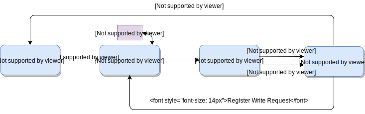

# 写回级

在写回 (Writeback) 阶段, 执行级各个功能部件完成其运算后将指令的结果传递过来. 如果指令能够顺利地传输到写回级, 则说明该指令被成功执行, 此后进入提交 (Commit) 状态, 对那些需要写回的指令, 把写寄存器堆请求发送给 ISU 执行.

另外, 在写回级还有一项重要的任务是进行指令的重定向 (Redirect) . 重定向主要会在一下几个场景中发生：

*  ALU 单元计算发现分支指令预测错误, 重定向程序计数器 PC 为正确的跳转地址
*  CSR 单元发现当前指令触发了异常或者产生了中断, 重定向程序计数器 PC 为相应的异常处理地址
* MOU 单元发现当前指令为 fencei 或者 sfence_vma, 重定向程序计数器 PC 为 PC + 4, 即下一条指令

重定向一旦发生, 会导致写回级之前所有流水级中的指令被冲刷掉. 这保证了我们的处理器核是实现精确异常的, 也解释了为什么 MOU 也会触发重定向 (目的并不是改变执行流, 而是冲刷流水线). 

功能单元在计算过程中产生重定向请求后, 不会立即触发, 而是会保留重定向信息, 顺着流水线传递到写回级, 统一由写回级传递给前端处理, 优先级在执行级（EXU）给出.

总结一下, 写回级与其他流水级的交互示意图如下:

