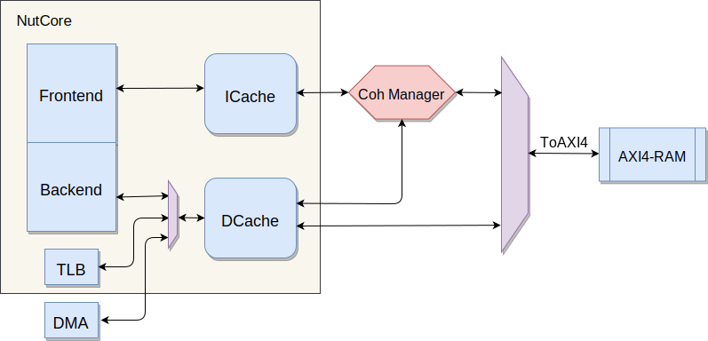

# 访存系统

NutShell 的访存模型示意图如下所示：

其中, NutCore 核心的访存请求从 ICache 和 DCache 里发出, 由 Coherence Manager 维护一致性, 最后将其转换为 AXI4 总线单读写口的访存请求接入到 RAM 中.

### 内存一致性

NutShell 满足缓存一致性. 从维护内存一致性的角度出发, 我们将 TLB 与 DMA 的访存请求接入到 DCache 中, 而不是接入内存之前的 CrossBar 里.

### 访存总线

除了与 AXI4-RAM 的交互使用 AXI4 总线, 其余所有的访存请求均采用 SimpleBus 总线. 与总线相关的内容, 请参考 [总线](bus.md) 章节.

